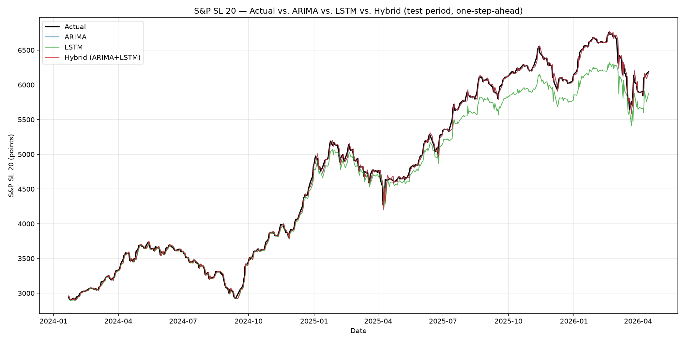
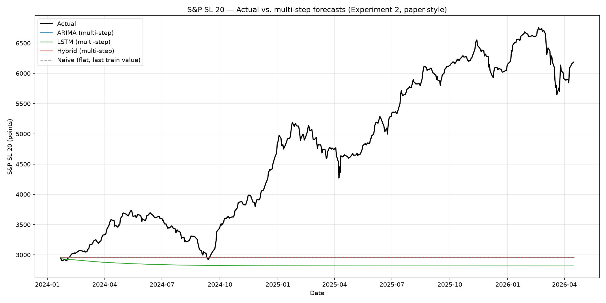

# Stock Price Prediction Using ARIMA, LSTM, and Hybrid

Forecasting the **S&P SL 20 index** of the Colombo Stock Exchange (CSE) with three
models — **ARIMA**, **LSTM**, and a **Hybrid ARIMA + LSTM** — on identical data and an
identical train/test split. The project reproduces and extends the study by
*Vithushan & Kethmi (IRC-OUSL 2025)*, adding the crisis years the paper excluded and a
hybrid model the paper only described.


---

## What this project does

It runs the comparison **two ways**, because how you forecast the test window changes the
numbers by an order of magnitude:

- **Experiment 1 — one-step-ahead** ("easy mode"): each day is predicted from the *true*
  recent history.
- **Experiment 2 — multi-step** ("hard mode", the paper's method): the model forecasts the
  whole test window forward using **only its own predictions**, never seeing a real test
  value. This is what makes the numbers comparable to the paper's Table 4.

A **naive persistence baseline** is included throughout to test whether the models add real
skill.

## Headline results

Test window: **2024-01-22 → 2026-04-16** (533 trading days). Lower is better.

| Model | 1-step MAE | 1-step MAPE | 1-step RMSE | Multi-step MAE | Multi-step MAPE | Multi-step RMSE |
|-------|-----------:|------------:|------------:|---------------:|----------------:|----------------:|
| Naive  | 37.06 | 0.79% | 56.16 | 1788.9 | 33.23% | **2162.5** |
| ARIMA  | 36.42 | 0.77% | 56.25 | 1792.8 | 33.32% | 2165.9 |
| LSTM   | 140.52 | 2.49% | 198.10 | 1913.9 | 35.93% | 2277.0 |
| Hybrid | **36.25** | **0.77%** | **56.15** | 1792.1 | 33.30% | 2165.3 |

**Takeaways:** one-step-ahead, the Hybrid is best but only marginally beats ARIMA and even the
naive baseline (daily persistence dominates). Multi-step, **no model beats the naive flat
line** — long-horizon forecasting of this trending index is effectively no-skill. Our
multi-step errors are far larger than the paper's 7% MAPE because our 2024–2026 test window is
a strong post-crisis bull run, whereas the paper's 2017–2018 window was roughly flat.

<p align="center">
  
  
</p>

*Left: one-step forecasts track the index tightly. Right: multi-step forecasts all flatten near
3000 while the index climbs to ~6700.*

## Repository structure

```
.
├── data/
│   ├── raw/                cse_indices_macro_clean.csv        (original multi-series feed)
│   └── processed/          spsl20_trading_days_clean.csv      (the file all scripts use)
├── src/
│   ├── 01_arima.py         Experiment 1 — ARIMA (one-step)
│   ├── 02_lstm.py          Experiment 1 — LSTM
│   ├── 03_hybrid.py        Experiment 1 — Hybrid
│   ├── 04_compare_results.py
│   ├── 05_arima_multistep.py   Experiment 2 — ARIMA (multi-step, paper-style)
│   ├── 06_lstm_multistep.py    Experiment 2 — LSTM (recursive)
│   ├── 07_hybrid_multistep.py  Experiment 2 — Hybrid
│   ├── 08_compare_multistep.py Naive baseline + combined comparison
│   └── make_report.py      Builds the PDF report
├── results/
│   ├── predictions/        per-model predictions + metrics (CSV/JSON)
│   ├── figures/            overlay charts (PNG)
│   └── tables/             comparison tables (CSV)
├── report/                 SPSL20_Full_Report.pdf
├── docs/                   detailed write-ups (see below)
├── references/             source_paper.pdf
├── requirements.txt
└── CLAUDE.md               project methodology / conventions
```

## How to run

```bash
# 1. Create and activate a virtual environment (Python 3.14)
python -m venv .venv
source .venv/bin/activate            # Windows: .venv\Scripts\activate

# 2. Install dependencies
pip install -r requirements.txt

# 3. Run the pipeline in order (each script reuses the saved split)
python src/01_arima.py
python src/02_lstm.py
python src/03_hybrid.py
python src/04_compare_results.py
python src/05_arima_multistep.py
python src/06_lstm_multistep.py
python src/07_hybrid_multistep.py
python src/08_compare_multistep.py

# 4. (optional) Rebuild the PDF report
python src/make_report.py
```

Outputs are written to `results/` and `report/`. Scripts resolve paths relative to the repo
root, so they work from any working directory.

## Method notes

- **Data:** univariate S&P SL 20 close, 2015–2026, weekends/holiday duplicates removed
  (2,664 trading days). The **2020–2023 crisis years sit in the training window**.
- **Split:** 80/20 chronological (never shuffled), fixed once in `split_info.json` and reused
  by every script so all models share identical train/test dates.
- **No leakage:** MinMax scalers are fit on the training portion only; ARIMA parameters are
  estimated on training data only.
- **LSTM:** implemented in **PyTorch** (Python 3.14 has no TensorFlow wheel) with the same
  architecture the paper implies — 2 stacked LSTM layers × 50 units, dropout 0.2, Dense(1),
  MSE loss, Adam, early stopping, fixed seeds.

## Documentation

- [`docs/PROJECT_DOCUMENTATION.md`](docs/PROJECT_DOCUMENTATION.md) — full methodology, results,
  and paper comparison
- [`docs/SUMMARY.md`](docs/SUMMARY.md) — one-page executive summary
- [`docs/EXPERIMENT2_paper_method.md`](docs/EXPERIMENT2_paper_method.md) — the multi-step spec
- [`docs/WORKFLOW_and_CHECKLIST.md`](docs/WORKFLOW_and_CHECKLIST.md) — stage-by-stage workflow
- [`report/SPSL20_Full_Report.pdf`](report/SPSL20_Full_Report.pdf) — the complete illustrated report

## Reference

Vithushan, M. & Kethmi, G. A. P. (2025). *A Comparative Analysis of Time Series Models for
Predicting the S&P SL 20 Index of the Colombo Stock Exchange (CSE).* IRC-OUSL 2025.
See [`references/source_paper.pdf`](references/source_paper.pdf).

## License

Released under the [MIT License](LICENSE).
